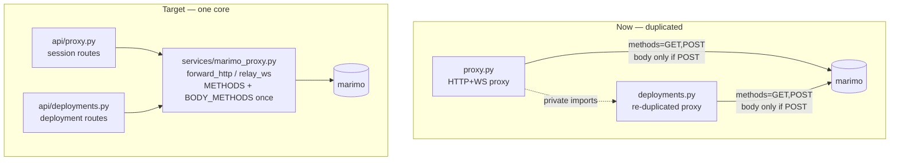

# MarimoHub — Architectural Fix Plan: Deploy + Runtime UX

Clean-sweep review of the five issues from the deployment smoke test. Each item below is a
concrete change with root cause (cited to `file:line`), the architectural fix, files to touch,
and acceptance criteria. No backwards-compatibility shims — the proxy and button layers are
small enough to consolidate outright.

`DESIGN.md` remains authoritative for schema, endpoints, and stack. Where this plan changes a
contract (proxy methods), `DESIGN.md` §API and the contract table must be updated first.

---

## Through-line: two duplication seams cause four of the five bugs

Before the per-issue fixes, name the two structural problems that the bugs are symptoms of.
Fixing these first makes the rest small.

**A. The reverse proxy is implemented twice.** `app/api/deployments.py:16` imports five
private helpers from `app/api/proxy.py` (`_filtered_header_pairs`, `_filtered_headers`,
`_request_body`, `_relay_websocket`, `_target_url`) and then re-duplicates `_close_upstream`
(`proxy.py:104` vs `deployments.py:104`) and the entire request-forwarding body
(`proxy.py:65-101` vs `deployments.py:109-144`). The allowed-method list and the
body-forwarding condition therefore exist in **two** places — which is why issue #2 has to be
fixed twice and why they have already drifted apart in subtle ways. There is one domain
concept here (reverse-proxy an HTTP/WS request to a marimo process), so there should be one
implementation.

**B. Button styling is re-inlined per component.** Every CTA hard-codes its own
foreground/background Tailwind pair (`+layout.svelte:56`, `auth/login/+page.svelte:100`,
`notebooks/[id]/+page.svelte:151,187,202`, `deploy/[slug]/+page.svelte:84`). There is no
shared button primitive, so contrast is decided ad hoc and several pairs fail WCAG AA. That is
issue #1.

### Fix A — extract one proxy core (`app/services/marimo_proxy.py`)

Move the proxy mechanics out of the API layer into a single service module. It owns:

- `PROXY_METHODS = ["GET", "POST", "PUT", "PATCH", "DELETE", "OPTIONS"]` — the one list both
  routers register.
- `_BODY_METHODS = {"POST", "PUT", "PATCH", "DELETE", "OPTIONS"}` — methods whose request body
  is streamed upstream (everything except `GET`/`HEAD`).
- `build_target_url`, header filtering, `forward_http(request, target, path) -> StreamingResponse`,
  and `relay_websocket(...)`.

`forward_http` forwards the body with `content=_request_body(request) if request.method in
_BODY_METHODS else None` — defined once. `api/proxy.py` and `api/deployments.py` become thin:
resolve the session/deployment, then delegate. Delete `deployments.py`'s duplicated
`_close_upstream`, `_proxy_deployment_request`, and the cross-module private imports.

**Files:** new `app/services/marimo_proxy.py`; rewrite `app/api/proxy.py`,
`app/api/deployments.py` to call it.
**Acceptance:** no underscore-prefixed symbol is imported across modules; the method list and
body rule each appear exactly once; `uv run pytest tests/test_sessions.py
tests/test_deployments.py` green.

### Fix B — one button primitive

Add a single `Button.svelte` (or a small set of CSS component classes in `app.css`:
`.btn-primary`, `.btn-secondary`, `.btn-ghost`) with explicit, AA-passing fg/bg pairs for both
themes. Every CTA in §1 below uses it. See issue #1 for the contrast pairs.

---

## Issue 1 — CTA contrast failures (light + dark)

**Root cause.** No shared button style (problem B). Failing pairs in the current inline styles:

- `bg-molten text-white` deploy button (`notebooks/[id]/+page.svelte:187`): white on `#f97316`
  is ≈2.9:1 — **fails** AA (needs 4.5:1). Use `text-slate-950` (dark ink) on molten, or darken
  the background for white text.
- Low-emphasis `bg-white/60 text-slate-800` / `dark:bg-white/10` secondary buttons
  (`notebooks/[id]/+page.svelte:153,156,158,206,212`): the translucent fills drop contrast
  below AA over busy/gradient backgrounds. Replace translucency with a solid token pair.

**Fix.** Introduce the button primitive (Fix B). Define three intents, each a verified
high-contrast pair in both themes:

- **primary** (Run, Login, Deploy, Open public deployment): solid `graphite`/`white` text in
  light, solid `white`/`slate-950` in dark — already AA; route the orange "primary accent"
  through this, not white-on-orange.
- **secondary** (Edit, Fork, Stop): solid (non-translucent) surface with `slate-800`/`white`
  text meeting AA in both themes.
- **ghost** (nav links): hover-only fill, text token meeting AA against the page background.

Migrate every CTA listed above plus `+layout.svelte:56`, `auth/login/+page.svelte:100`,
`deploy/[slug]/+page.svelte:84` to the primitive. Delete the per-component color classes.

**Files:** `frontend/src/lib/components/Button.svelte` (or `app.css` component classes);
`+layout.svelte`, `auth/login/+page.svelte`, `auth/register/+page.svelte`,
`notebooks/[id]/+page.svelte`, `notebooks/[id]/edit/+page.svelte`,
`notebooks/[id]/run/+page.svelte`, `notebooks/new/+page.svelte`, `deploy/[slug]/+page.svelte`,
`discover/+page.svelte`.
**Acceptance.** `npm run check` clean; every migrated CTA uses the primitive (no inline
fg/bg color pairs remain on buttons); manual AA check passes in light and dark for header
Login, form Login, notebook Run, deploy button, and Open-public-deployment.

---

## Issue 2 — Marimo package install fails (proxy too narrow)

**Root cause.** Marimo's package-management calls use non-`POST` body methods and the proxy
drops them on the floor:

- Method allow-list omits `PUT/PATCH/DELETE/OPTIONS`: `proxy.py:65`
  (`methods=["GET", "POST"]`) and `deployments.py:195-196` (same).
- Request body is forwarded **only** for `POST`: `proxy.py:87` and `deployments.py:130`
  (`content=... if request.method == "POST" else None`). A `PUT`/`PATCH` install request
  reaches marimo with an empty body.

**Fix.** Land via Fix A. After extraction, both routers register `PROXY_METHODS`
(`GET|POST|PUT|PATCH|DELETE|OPTIONS`) and `forward_http` streams the body for every method in
`_BODY_METHODS`. Update the contract: the proxy/deployment rows in `DESIGN.md` §API and §5
already list `GET|POST|PUT|PATCH|DELETE|OPTIONS` — verify the code now matches.

**Files:** as Fix A.
**Acceptance.** Regression tests in `tests/test_sessions.py` and `tests/test_deployments.py`
prove that, through both `/api/proxy/{session_id}/...` and `/api/deployments/{slug}/...`,
non-`POST` requests with bodies (`PUT`, `PATCH`, `DELETE`) preserve: request body, headers,
query string, and the injected `access_token`. Smoke: install `polars` from an edit session.

---

## Issue 3 — Package-environment isolation decision

**Root cause / scope.** Installs from a marimo edit session currently land in the backend's
shared `.venv` (the process is spawned with `marimo edit` inheriting the backend interpreter,
`process_manager.py:180-186`, `_marimo_command:306-324`). This is a deliberate MVP choice, not
a bug — but it must be recorded so it isn't mistaken for one, and the seam for the real fix
must be named.

**Decision (MVP).** Keep global backend-`.venv` installs for now. Do **not** add per-notebook
environments in this batch.

**Seam for the follow-up.** Per-notebook isolation is a one-line change at the command seam,
not a new subsystem: marimo's `--sandbox` flag runs a notebook in an isolated `uv` environment
derived from PEP 723 inline script metadata. The real fix is to add `--sandbox` (and persist a
per-notebook dependency manifest) in `_marimo_command` (`process_manager.py:306`). Open a
follow-up; no code now.

**Files:** none in this batch beyond a short note in `DESIGN.md` recording the decision and the
`--sandbox` seam.
**Acceptance.** Decision recorded; no speculative environment code added.

---

## Issue 4 — Slug validation leaks Pydantic regex message

**Root cause.** `DeploymentCreate.slug` carries a raw `pattern=` constraint
(`schemas/deployment.py:7`), so a bad slug returns Pydantic's default
`String should match pattern ^[a-z0-9]+(?:-[a-z0-9]+)*$` in `detail`, surfaced verbatim to the
user. There is also no client-side pre-validation on the deploy form
(`notebooks/[id]/+page.svelte`).

**Fix.** Keep the rule, replace the message on both ends:

- **Backend:** replace the inline `pattern=` with a field validator (or `Annotated` +
  `AfterValidator`) that raises with the friendly copy: *"Use lowercase letters, numbers, and
  hyphens. Start and end with a letter or number."* Keep `min_length=1`, `max_length=255`, and
  the same regex as the source of truth.
- **Frontend:** validate the slug input against the same regex before submit and show the same
  copy inline; disable submit while invalid.

**Files:** `backend/app/schemas/deployment.py`; `frontend/src/routes/notebooks/[id]/+page.svelte`
(deploy form). Add `tests/test_deployments.py` case asserting the friendly `detail`.
**Acceptance.** Posting an invalid slug returns 422/400 with the friendly message and no regex
fragment; the form blocks submission and shows the same copy; valid slugs still deploy.

---

## Issue 5 — Public deployment wake timeout

**Root cause.** Two limitations compound:

1. The readiness budget is a hard-coded module constant, not configurable:
   `process_manager.py:23` (`READINESS_TIMEOUT_SECONDS = 10.0`), consumed by
   `_wait_until_ready` (`:278-287`). A legitimately slow cold start (notebook importing a
   freshly installed package) exceeds 10s and the wake fails.
2. Failures are unobservable and uninformative. Child stderr is discarded
   (`process_manager.py:185`, `stderr=asyncio.subprocess.DEVNULL`), and `_wake_deployment`
   raises a generic `503 "Deployment failed to wake"` (`deployments.py:83`) with nothing logged
   server-side, so the real cause can't be diagnosed.

**Fix.**

- **Make the timeout configurable.** Add `MARIMO_READY_TIMEOUT_SECONDS: float = 15.0` to
  `Settings` (`core/config.py`) and `.env.example`; thread it into `ProcessManager` (via
  `from_settings`) and use it in `_wait_until_ready` instead of the constant. Remove the
  hard-coded `READINESS_TIMEOUT_SECONDS`.
- **Capture and log process failure.** Spawn with `stderr=asyncio.subprocess.PIPE` (or a temp
  log file in the workdir). When `_wait_until_ready` detects the process exited
  (`process_manager.py:281-282`) or times out, read the captured stderr, **log it server-side**
  (logger.error with deployment id/slug), and raise `SessionStartError` carrying a short reason.
- **Actionable 503.** `_wake_deployment` maps `SessionStartError` to a 503 whose `detail`
  distinguishes "did not start in time" from "process exited" — without leaking stack traces.

**Files:** `backend/app/core/config.py`, `.env.example`; `backend/app/services/process_manager.py`;
`backend/app/api/deployments.py`. Tests in `tests/test_process_manager.py` (timeout honors the
setting; exited-process path logs and raises) and `tests/test_deployments.py` (503 detail
shape).
**Acceptance.** Readiness timeout is driven by `MARIMO_READY_TIMEOUT_SECONDS`; a deployment of
a notebook importing an installed package wakes within the configured budget; a process that
exits during wake yields a 503 with an actionable detail and a server-side log line containing
the underlying stderr.

---

## Verify (whole batch)

- `cd backend && uv run pytest tests/test_sessions.py tests/test_deployments.py tests/test_process_manager.py`
- `cd frontend && npm run check`
- Smoke: register/login → create blank notebook → install `polars` in edit mode → run notebook
  → deploy with a valid slug and with an invalid slug (friendly error) → open the public
  deployment, in both light and dark mode.

## Order of work

1. **Fix A** (proxy core) — unblocks issue #2 and removes the duplication that would otherwise
   force every later proxy change to be made twice.
2. **Issue 2** regression tests against the extracted core.
3. **Issue 5** (configurable timeout + stderr capture + actionable 503).
4. **Issue 4** (slug message, both ends).
5. **Fix B + Issue 1** (button primitive + CTA migration).
6. **Issue 3** — record the decision; no code.
